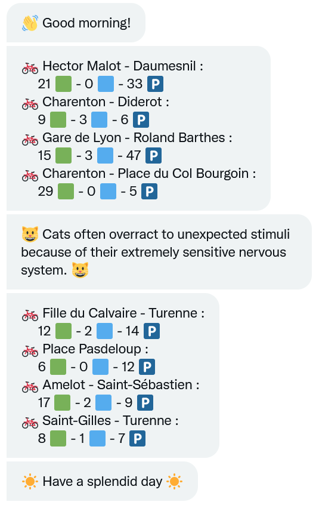

# VelibAndCats
- VelibAndCats is a script that sends (via Twitter Direct Message) **infos about Velib** station status along with **a cat fact**.
- it uses the [Cat Facts API](https://catfact.ninja/) and the [Velib Metropole API](https://www.velib-metropole.fr/donnees-open-data-gbfs-du-service-velib-metropole)
- it detects if it is the morning or not:
  - ajusts the greeting and good bye message,
  - in the morning home stations are displayed first, then day/work stations
  - in the evening that order is reversed
- can be personnalized by adding users and their lists of stations of interest
- can be run as a scheduled task on a NAS



Visit https://twitter.com/E_Dmz_Bot for more

## Prequisites
* Write and read keys for @your_bot https://developer.twitter.com/en/portal/dashboard

* Python 3 with python-twitter library

* CRON or NAS

## Installation
### 1. Clone repo
```bash
git clone https://github.com/E-Dmz/VelibAndCats.git
```
### 2. Manage your keys
Modify `keys_template.py` with your own keys and save it as `keys.py`.

### 3. Test and personnalize
- modify and test in the .ipynb (*please do change the ids*)
- update the .py script: run `jupyter nbconvert --to script VelibAndCats.ipynb`
- run
`python path/to/VelibAndCats.py <username>`

### 4. Set up a CRON job / a NAS scheduled task
```bash
crontab -e
# copy the following line:
# 0 6 * * * python3 path/to/WakeUp/WakeUp.py
# Ctrl + S Ctrl + X
crontab -l
# this one is helpful to check on cron jobs:
grep CRON /var/log/syslog
```
